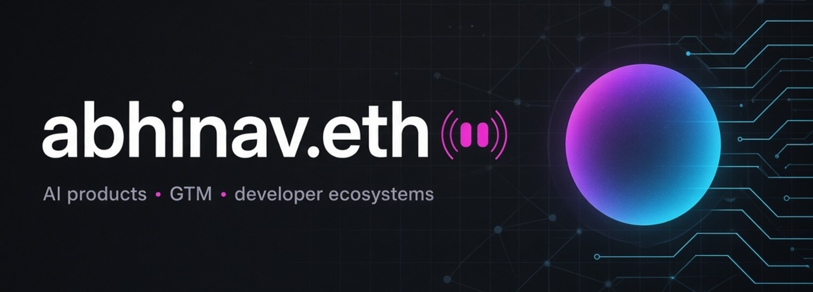

<div align="center">



<br />

[](https://x.com/abhinav_g21)
[](https://www.linkedin.com/in/abhinav-gupta-cs/)
[](https://zynd.ai)
[](https://x.com/zeroxspace_)


</div>

---

**I build at the intersection of AI products, GTM, and developer ecosystems.**

Right now: AI products + GTM at **[Zynd AI](https://zynd.ai)** — identity, discovery, and payments for agents — and building **[0xSpace](https://x.com/zeroxspace_)**, a 50K+ developer community.

Previously scaled communities, events, and partnerships across Web3 (hackathons, ecosystem programs, 0→1 growth).

---

### now

```text
building  →  Zynd AI · product & GTM
            0xSpace · 50K+ developer community
focus     →  AI agents, tool calling, MCP
            community-led growth
open to   →  builders, founders, operators
            if you're shipping agents or communities, say hi
